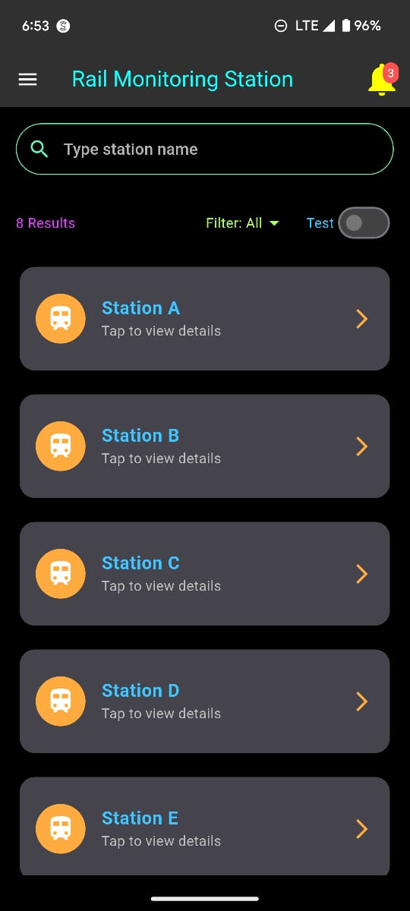
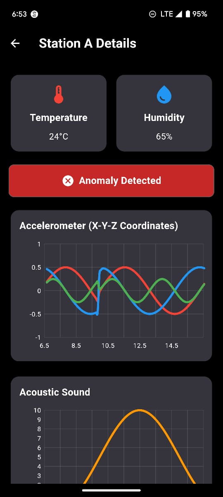
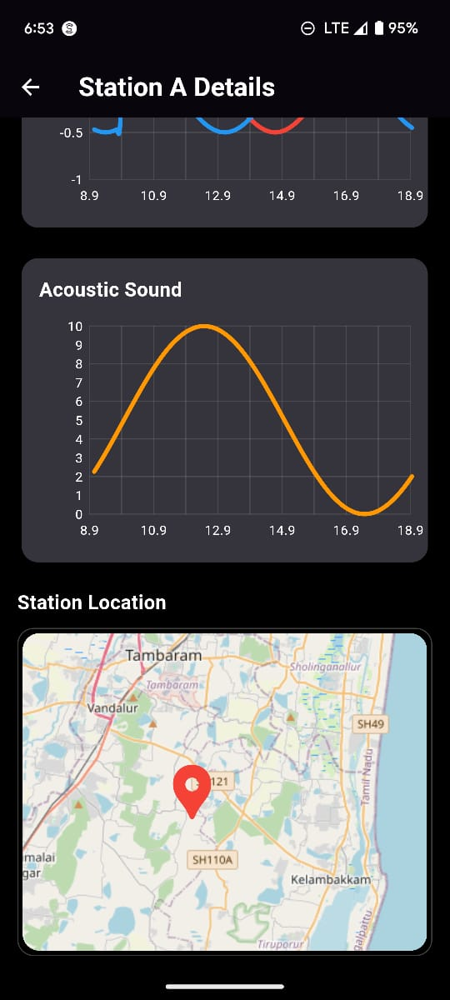

# Rail Monitoring System

A Flutter application for real-time monitoring of rail systems using sensor data. This project leverages a WebSocket connection to fetch live sensor readings—including temperature, humidity, accelerometer, acoustic sound, and gyroscope data—and displays the information using a combination of charts, gauges, and maps. The app is built with a dark-themed UI and leverages several Flutter packages to deliver an interactive and responsive user experience.

## 🚀 Features

- 🔴 **Real-time Monitoring**: Connect to stations via WebSocket for live data streaming  
- 🧭 **Multiple Stations Management**: View and manage multiple monitoring stations  
- 📊 **Comprehensive Sensor Visualization**:
  - 🌡️ Temperature and humidity readings  
  - 📈 Accelerometer data (X-Y-Z coordinates) with real-time graphs  
  - 🧭 Gyroscope measurements with intuitive gauge visualization  
  - 🔊 Acoustic sound level monitoring with dynamic graphs  
- 🚨 **Anomaly Detection**: Visual indicators when sensor readings fall outside normal parameters  
- 🗺️ **Station Geolocation**: Map integration showing the physical location of each station  
- 🌙 **Dark Theme UI**: Eye-friendly interface optimized for field use  

## 📸 Screenshots

<p align="center">
  
  
  
  
</p>

## Technical Implementation

- 🔌 **WebSocket Connection**
  - Maintains real-time connections with stations
  - 🔄 Automatic reconnection with exponential backoff
  - ⚠️ Robust error handling and data validation

- 📊 **Sensor Data Visualization**
  - 🌡️ **Temperature & Humidity**: Real-time environmental display
  - 📈 **Accelerometer**: X-Y-Z axis line graphs
  - 🧭 **Gyroscope**: Orientation shown via gauges
  - 🔊 **Acoustic Sound**: Live sound level line graphs

- 🗺️ **Maps Integration**
  - Interactive map using Flutter Map (Leaflet) to display station locations

## 🛠️ Installation

1.  **Clone the repository**
   ```bash
   git clone https://github.com/varad349/Rail-Monitoring-System.git
   ```

2.  **Navigate to the project directory**
   ```bash
   cd rail-monitoring-system
   ```

3.  **Install dependencies**
   ```bash
   flutter pub get
   ```

4.  **Configure WebSocket URL**  
   Open `main.dart` and update the WebSocket URL to your server:
   ```dart
   ChangeNotifierProvider(
     create: (_) => WebSocketService('ws://your-server-url:port/'),
   ),
   ```

5.  **Run the application**
   ```bash
   flutter run
   ```
